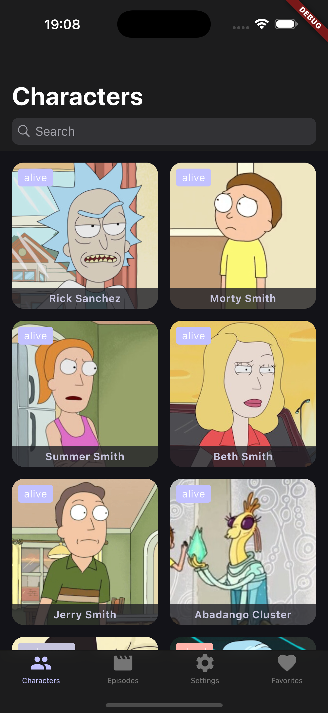
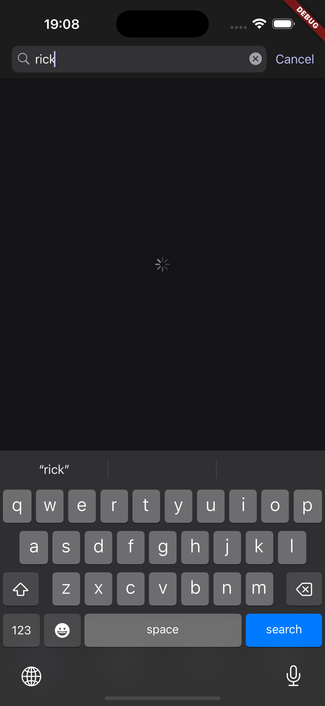
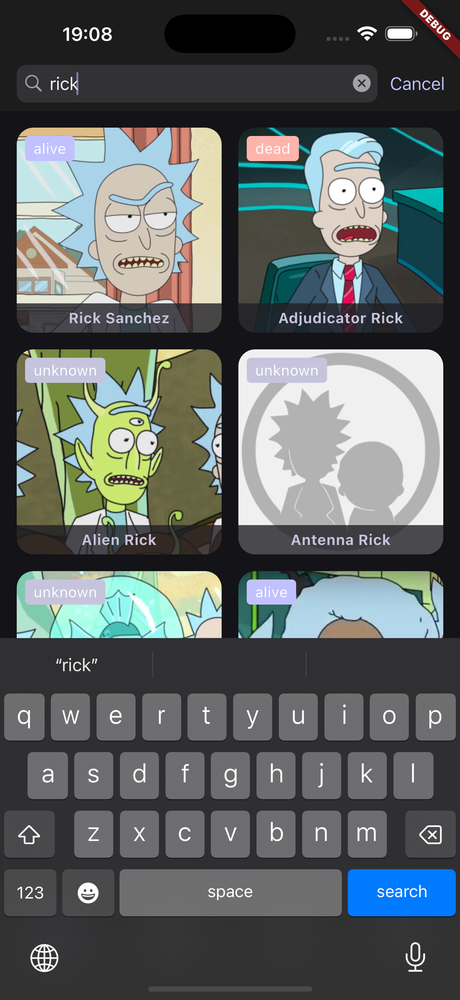
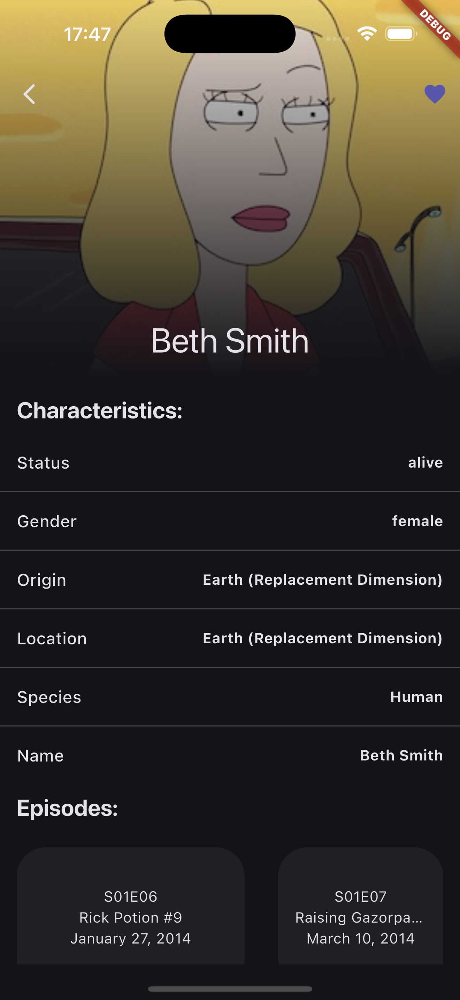
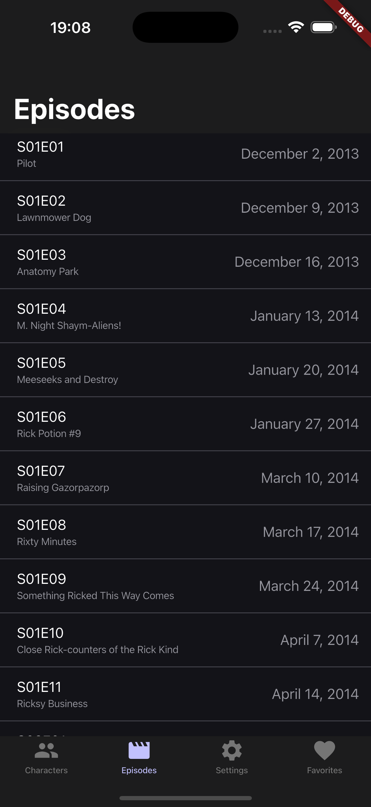
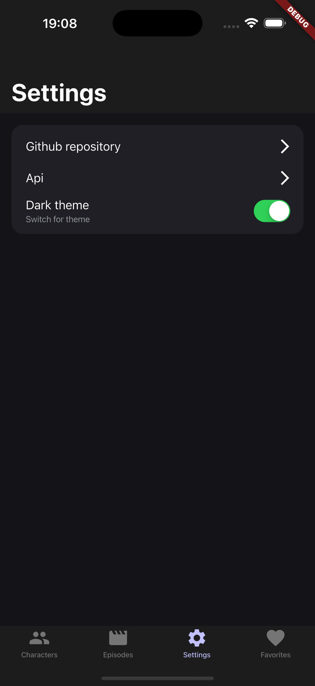
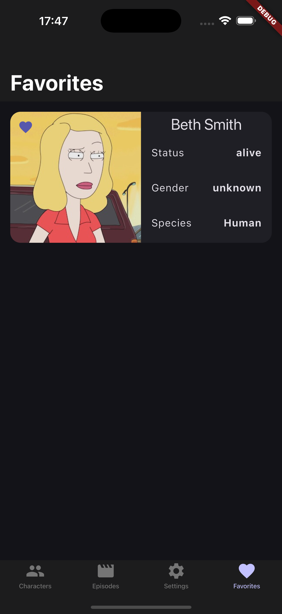
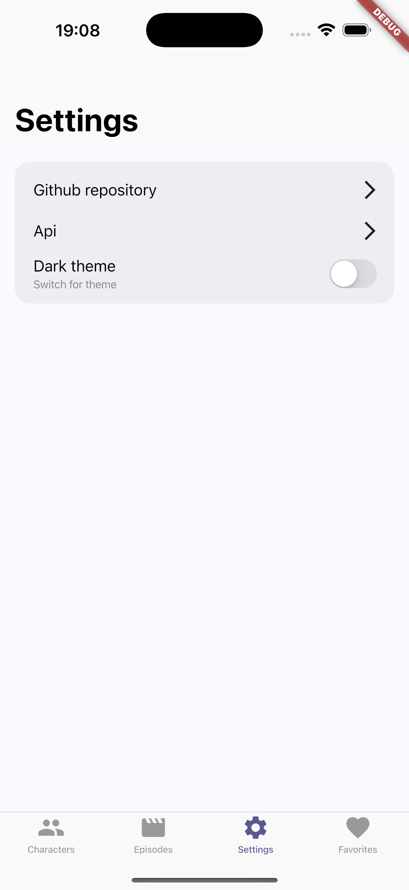
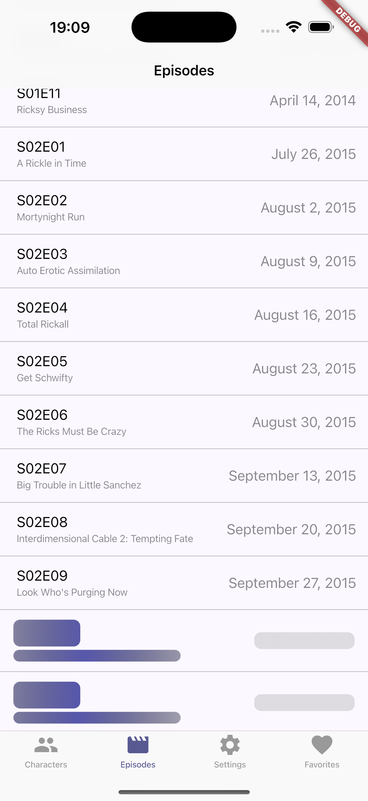

# Rick Morty App

<div align="center">
    
    
    
    
    
    
    
    
    
</div>

## About the project

Rick Morty App - приложение для поиска и просмотра персонажей Rick&Morty с возможностью добавление персонажа в избранное. Также есть список эпизодов и смена темы приложения.


Функционал:
- 4 таба
- Список персонажей(есть возможность открыть деталку, подгрузить еще пачку персонажей, перезагрузить список, использовать поиск)
- Список серий(есть возможность подгрузить еще пачку эпизодов, перезагрузить список)
- Настройки(2 ссылки - апи и гитхаб, свич для смены темы)
- Лакнутые(список лайкнутых персонажей)
- Все списки подгружают данные пачками по 20 элементов. Для iOS/Android используются их платформенные виджеты(в навигации в основном)

Проект разбит на фичи, каждая фича поделена на слои(presentation, domain, data), domain - бизнес логика, presentation - слой view+управления состоянием, data - уровень доступа к данным(локальным или удаленным).

### Build with

[](https://skillicons.dev)
- Flutter
- Dart
- BloC
- auto_router
- dio, json_serializable
- drift, shared_preferences, cached_network_image

## Getting started
Установите пакеты
```sh
$ flutter pub get
```
Сгенерируйте файлы
```sh
$ flutter pub run build_runner build
```

Запустите приложение
```sh
$ flutter run
```